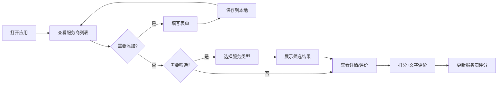

## 1. 产品概述

本地维修服务商管理工具，帮助用户记录和管理曾用过的维修师傅/公司信息，包括水电工、家电维修、开锁、通下水道、空调加氟等各类服务。解决用户"需要维修时找不到联系方式"、"忘记之前哪家服务好"的痛点。

### 1.1 核心价值
- 集中管理维修服务商信息，避免零散记录
- 通过评分和评价体系，快速筛选优质服务商
- 按服务类型分类，需要时快速定位

---

## 2. 核心功能

### 2.1 用户角色
| 角色 | 注册方式 | 核心权限 |
|------|----------|----------|
| 普通用户 | 无需注册，本地使用 | 增删改查服务商信息、评分评价、筛选查询 |

### 2.2 功能模块
1. **服务商列表页**：展示所有服务商、按服务类型筛选、搜索
2. **添加/编辑服务商**：录入名称、联系方式、服务类型、上门费、是否开票
3. **评分评价**：1-5星打分、文字评价标签
4. **详情查看**：查看服务商完整信息和历史评价

### 2.3 页面详情
| 页面名称 | 模块名称 | 功能描述 |
|----------|----------|----------|
| 服务商列表 | 顶部筛选栏 | 服务类型下拉筛选、搜索框、添加按钮 |
| 服务商列表 | 卡片列表 | 展示服务商名称、联系方式、服务类型、评分、上门费 |
| 添加/编辑表单 | 表单模块 | 名称、电话、服务类型多选、上门费、是否开票开关 |
| 评分评价 | 星级评分 | 1-5星点击打分、平均星级显示 |
| 评分评价 | 评价标签 | 预设标签（技术好、收费贵、响应快等）+ 自定义文字 |
| 详情弹窗 | 信息展示 | 完整信息展示、历史评价记录、操作按钮（编辑/删除） |

---

## 3. 核心流程

### 3.1 录入服务商流程
用户打开应用 → 点击"添加服务商" → 填写基本信息 → 选择服务类型 → 提交保存 → 列表显示新服务商

### 3.2 查找服务商流程
用户需要维修 → 打开应用 → 选择服务类型（如"空调加氟"） → 浏览筛选后的服务商 → 查看评分评价 → 联系服务商

### 3.3 评价流程
用户接受服务后 → 找到对应服务商 → 点击"评价" → 选择星级 → 添加评价标签/文字 → 提交保存

---

## 4. 用户界面设计

### 4.1 设计风格
- **主色调**：暖橙色系（#FF6B35 主色），传达"可靠、温暖、及时"的维修服务感
- **辅助色**：深蓝色（#1A365D）用于文字和重要信息
- **中性色**：米白背景（#FAF8F5），浅灰边框，营造干净实用的氛围
- **设计方向**：实用主义+温暖质感，卡片式布局，清晰的信息层级
- **按钮风格**：圆角8px，实心按钮带轻微阴影，hover时上浮效果
- **字体**：标题用"Noto Serif SC"增加品质感，正文用"Noto Sans SC"保证可读性
- **图标**：使用线条型图标，简约清晰

### 4.2 页面设计概述
| 页面名称 | 模块名称 | UI元素 |
|----------|----------|--------|
| 服务商列表 | 顶部筛选栏 | 左侧logo+标题，右侧筛选下拉、搜索框、添加按钮 |
| 服务商列表 | 卡片网格 | 卡片带橙色边框悬浮效果，星级评分醒目显示，标签彩色圆角 |
| 添加/编辑表单 | 表单弹窗 | 半透明遮罩，居中弹窗，表单字段左对齐，底部操作按钮 |
| 星级评分 | 交互组件 | 空心星→实心星填充动画，hover时预览效果 |
| 评价标签 | 标签选择 | 预设标签可点击切换选中状态，文字输入框 |
| 详情弹窗 | 信息展示 | 大标题、联系方式卡片、评分区域、评价时间线 |

### 4.3 响应式
- **桌面优先**：3列卡片网格（1200px+），2列（768-1200px），1列（<768px）
- **移动端适配**：筛选栏折行，按钮触控区域≥44px，弹窗全屏显示
- **触摸优化**：滑动删除、长按查看详情

---

## 5. 数据存储说明
- 使用浏览器 localStorage 进行本地存储
- 数据结构包含：服务商基本信息、服务类型、评分记录、评价内容
- 支持数据导出/导入（JSON格式）方便备份
