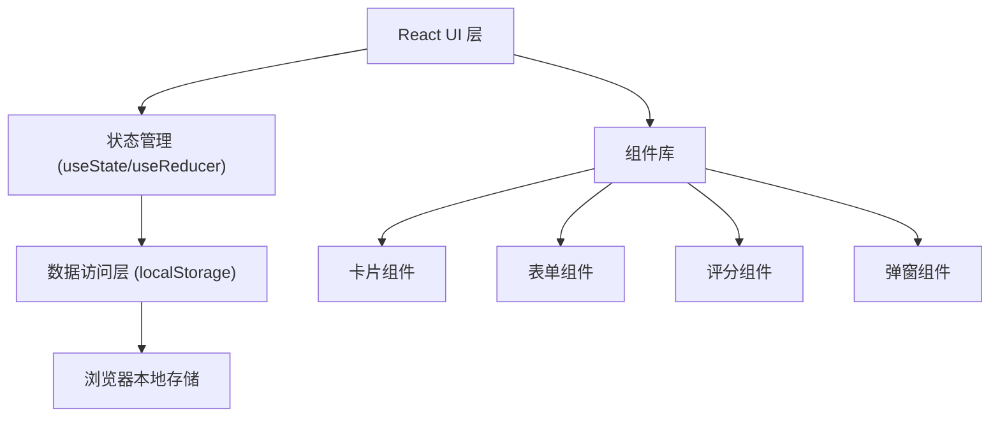
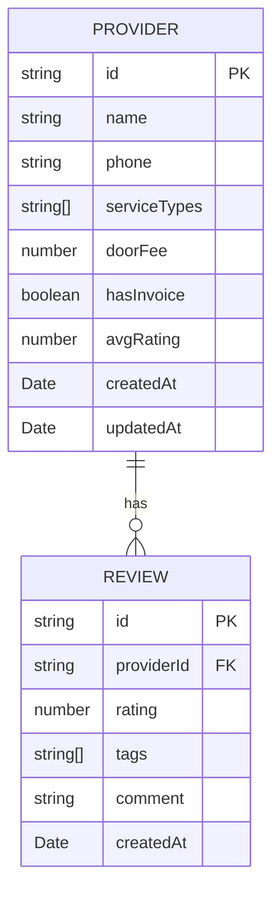

## 1. 架构设计

纯前端单页应用，数据存储在浏览器 localStorage，无需后端服务。



---

## 2. 技术描述

- **前端框架**：React@18 + TypeScript
- **构建工具**：Vite@5
- **样式方案**：TailwindCSS@3 + CSS Variables
- **图标库**：Lucide React（线条型图标）
- **状态管理**：React Hooks (useState, useEffect, useReducer)
- **数据存储**：浏览器 localStorage
- **动画库**：Framer Motion（用于交互动画）
- **初始化方式**：`npm create vite@latest . -- --template react-ts`

---

## 3. 目录结构

```
src/
├── components/          # 组件目录
│   ├── Header.tsx       # 顶部导航栏
│   ├── FilterBar.tsx    # 筛选栏
│   ├── ProviderCard.tsx # 服务商卡片
│   ├── ProviderList.tsx # 服务商列表
│   ├── ProviderForm.tsx # 添加/编辑表单
│   ├── StarRating.tsx   # 星级评分
│   ├── ReviewForm.tsx   # 评价表单
│   ├── DetailModal.tsx  # 详情弹窗
│   └── TagSelector.tsx  # 标签选择器
├── hooks/               # 自定义Hooks
│   ├── useProviders.ts  # 服务商数据管理
│   └── useLocalStorage.ts # localStorage封装
├── types/               # TypeScript类型
│   └── index.ts
├── utils/               # 工具函数
│   ├── storage.ts       # 存储工具
│   └── constants.ts     # 常量定义
├── App.tsx              # 主应用组件
├── main.tsx             # 入口文件
└── index.css            # 全局样式
```

---

## 4. 路由定义

单页应用，无需路由，通过状态控制弹窗显示。

| 状态 | 显示内容 |
|------|----------|
| 默认 | 服务商列表 + 筛选栏 |
| 新增/编辑 | 表单弹窗 |
| 查看详情 | 详情弹窗 |
| 添加评价 | 评价弹窗 |

---

## 5. 数据模型

### 5.1 ER图



### 5.2 TypeScript 类型定义

```typescript
// 服务类型枚举
export type ServiceType = 
  | 'plumber'      // 水电工
  | 'appliance'    // 家电维修
  | 'locksmith'    // 开锁
  | 'drain'        // 通下水道
  | 'aircon'       // 空调加氟
  | 'other';       // 其他

// 评价标签
export type ReviewTag = 
  | '技术好' 
  | '收费贵' 
  | '响应快' 
  | '态度好' 
  | '不专业' 
  | '乱收费' 
  | '准时';

// 服务商
export interface Provider {
  id: string;
  name: string;
  phone: string;
  serviceTypes: ServiceType[];
  doorFee: number | null;
  hasInvoice: boolean;
  avgRating: number;
  createdAt: string;
  updatedAt: string;
}

// 评价
export interface Review {
  id: string;
  providerId: string;
  rating: number; // 1-5
  tags: ReviewTag[];
  comment: string;
  createdAt: string;
}

// 服务类型配置
export const SERVICE_TYPE_CONFIG: Record<ServiceType, { label: string; icon: string; color: string }> = {
  plumber: { label: '水电工', icon: 'wrench', color: '#3B82F6' },
  appliance: { label: '家电维修', icon: 'tv', color: '#8B5CF6' },
  locksmith: { label: '开锁', icon: 'key', color: '#F59E0B' },
  drain: { label: '通下水道', icon: 'droplets', color: '#10B981' },
  aircon: { label: '空调加氟', icon: 'wind', color: '#06B6D4' },
  other: { label: '其他', icon: 'more-horizontal', color: '#6B7280' },
};

// 预设评价标签
export const REVIEW_TAGS: ReviewTag[] = ['技术好', '收费贵', '响应快', '态度好', '不专业', '乱收费', '准时'];
```

### 5.3 localStorage 存储键

- `repair_providers` - 服务商列表
- `repair_reviews` - 评价列表

数据格式为 JSON 字符串数组。

---

## 6. 核心功能实现要点

### 6.1 数据管理 Hook (useProviders.ts)
- 封装 CRUD 操作
- 自动计算平均评分
- 筛选和搜索逻辑
- 数据持久化

### 6.2 星级评分组件
- 支持点击打分（1-5星）
- 支持只读显示
- hover 预览效果
- 半星显示支持

### 6.3 筛选逻辑
- 按服务类型筛选（多选支持）
- 按名称/电话搜索
- 按评分排序

### 6.4 表单验证
- 名称必填
- 电话格式验证
- 至少选择一种服务类型

---

## 7. Mock 数据

初始化时提供3-5条示例数据，帮助用户快速理解使用方式。
